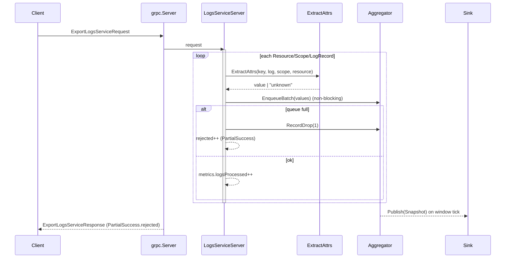
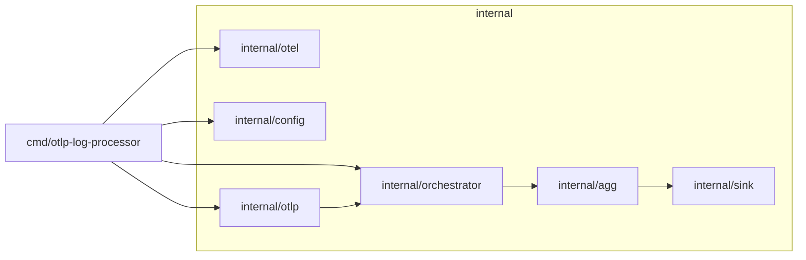

# Architecture Diagrams — OTLP Log Processor (Go)

## Component Overview

```mermaid
flowchart TD
  Client[Client(s)] -->|OTLP Logs Export (gRPC)| GRPC[grpc.Server]
  GRPC --> LogsSvc[internal/otlp\nLogsServiceServer]

  subgraph App Process
    Cmd[cmd/otlp-log-processor\nmain]
    Cfg[internal/config\nConfig]
    OTel[internal/otel\nSetup]
    Orch[internal/orchestrator\nService (instance-scoped)]
    Extract[internal/otlp\nExtractAttrs(key,log,scope,res)]
    Queue[(Ingestion Queue\nchan Event)]
    Agg[internal/aggregator\nAggregator (goroutine\n+ticker windowing)]
    Sink[internal/sink\nJSONSink (stdout)]
  end

  Cmd -->|flag.Parse| Cfg
  Cmd -->|Setup(ctx)| OTel
  Cmd -->|New(cfg, logger)| Orch
  Cmd -->|start| GRPC
  Orch -->|owns| Agg
  Agg -->|Publish(Snapshot)| Sink

  LogsSvc -->|for each record| Extract
  Extract -->|value or "unknown"| Queue
  Agg <-->|non-blocking Enqueue/EnqueueBatch| Queue

  %% Telemetry (observability) paths
  GRPC -. traces/metrics .-> OTel
  LogsSvc -. counters .-> OTel
  Agg -. counters/gauges .-> OTel
```

Key points:
- Single-queue → single-writer aggregator for simplicity and throughput.
- Attribute extraction precedence: Log > Scope > Resource; fallback "unknown".
- Backpressure via bounded channel; drops accounted in PartialSuccess and metrics.
- Sink is pluggable; JSON stdout is the default implementation.

## Export Path — Sequence



## Packages and Dependencies



Legend:
- internal/*: core business logic and app wiring (not importable by external modules).
- cmd/*: binary entrypoint.
